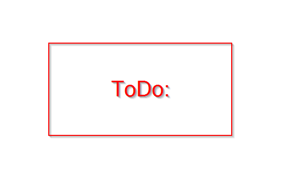
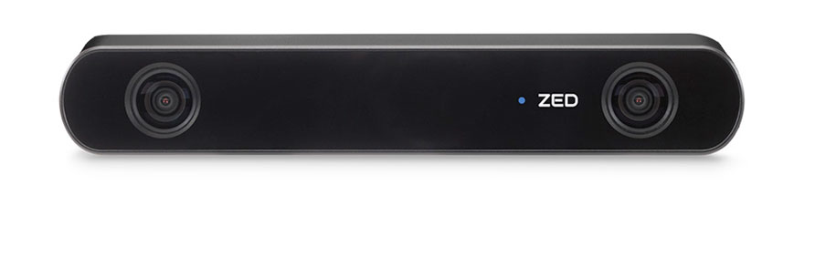

# ZED Social Distance
## A Project to Compute the Distance Between People

This project integrates the ZED SDK and Stereolabs ZED camera to compute the real-world distance between people. The ZED produces a depth map that can be used to extract the cartesian coordinates of each pixel in 3D space relative to the camera image. Using the depth map, distances between pixels in the image can be computed that equate to a real-world distance. The acknowledged projects were integrated to provide human detection and tracking. Once a person is detected and tracked, its distance from other people is computed and displayed.




This project was forked from: https://github.com/theAIGuysCode/yolov3_deepsort
and uses technology from:
 - https://github.com/zzh8829/yolov3-tf2
 - https://github.com/nwojke/deep_sort
 - https://arxiv.org/abs/1804.02767


## Required Hardware
This project requires the use of the Sterolabs ZED Stereovision camera system and the ZED SDK for Python (Py-ZED)

You will need to install the ZED SDk
 - Getting started guide here: https://www.stereolabs.com/developers/
 - Py-ZED install docs here: https://www.stereolabs.com/docs/app-development/python/install/
 - You will also need to install the SDK's dependencies (inc. Nvidia CUDA)


## Getting Started 
These requirements have been curated from the original repo to be able to run YOLOv3, DeepSORT, and Tensorflow using the COCO dataset. (Some tweaking may be required to get them to work with the ZED SDK and CUDA on your system... use of Conda advised.)

#### Conda (Recommended)

```bash
# Tensorflow CPU
conda env create -f conda-cpu.yml
conda activate tracker-cpu

# Tensorflow GPU
conda env create -f conda-gpu.yml
conda activate tracker-gpu
```

#### Pip
```bash
# TensorFlow CPU
pip install -r requirements.txt

# TensorFlow GPU
pip install -r requirements-gpu.txt
```

### Nvidia Driver (For GPU, if you haven't set it up already)
```bash
# Ubuntu 18.04
sudo add-apt-repository ppa:graphics-drivers/ppa
sudo apt install nvidia-driver-430
# Windows/Other
https://www.nvidia.com/Download/index.aspx
```
### Downloading official pretrained weights
For Linux: Let's download official yolov3 weights pretrained on COCO dataset. 

```
# yolov3
wget https://pjreddie.com/media/files/yolov3.weights -O weights/yolov3.weights

# yolov3-tiny
wget https://pjreddie.com/media/files/yolov3-tiny.weights -O weights/yolov3-tiny.weights
```
For Windows:
You can download the yolov3 weights by clicking [here](https://pjreddie.com/media/files/yolov3.weights) and yolov3-tiny [here](https://pjreddie.com/media/files/yolov3-tiny.weights) then save them to the weights folder.

### Using Custom trained weights
<strong> Learn How To Train Custom YOLOV3 Weights Here: https://www.youtube.com/watch?v=zJDUhGL26iU </strong>

Add your custom weights file to weights folder and your custom .names file into data/labels folder.
  
### Saving your yolov3 weights as a TensorFlow model.
Load the weights using `load_weights.py` script. This will convert the yolov3 weights into TensorFlow .tf model files!

```
# yolov3
python load_weights.py

# yolov3-tiny
python load_weights.py --weights ./weights/yolov3-tiny.weights --output ./weights/yolov3-tiny.tf --tiny

# yolov3-custom (add --tiny flag if your custom weights were trained for tiny model)
python load_weights.py --weights ./weights/<YOUR CUSTOM WEIGHTS FILE> --output ./weights/yolov3-custom.tf --num_classes <# CLASSES>
```

After executing one of the above lines, you should see proper .tf files in your weights folder. You are now ready to run object tracker.

## Running the Object Tracker
You can run the object tracker for whichever model you have created, pretrained, tiny, or custom.
```

#yolov3 on Stereolabs ZED 
python social_distance.py

#yolov3-tiny 
python social_distance.py --weights ./weights/yolov3-tiny.tf --tiny

#yolov3-custom (add --tiny flag if your custom weights were trained for tiny model)
python social_distance.py  --weights ./weights/yolov3-custom.tf --num_classes <# CLASSES> --classes ./data/labels/<YOUR CUSTOM .names FILE>
```
Video input/output is not currently supported.

## Command Line Args Reference
```
load_weights.py:
  --output: path to output
    (default: './weights/yolov3.tf')
  --[no]tiny: yolov3 or yolov3-tiny
    (default: 'false')
  --weights: path to weights file
    (default: './weights/yolov3.weights')
  --num_classes: number of classes in the model
    (default: '80')
    (an integer)
    
social_distance.py:
  --classes: path to classes file
    (default: './data/labels/coco.names')
  --[no]tiny: yolov3 or yolov3-tiny
    (default: 'false')
  --weights: path to weights file
    (default: './weights/yolov3.tf')
  --num_classes: number of classes in the model
    (default: '80')
    (an integer)
  --yolo_max_boxes: maximum number of detections at one time
    (default: '100')
    (an integer)
  --yolo_iou_threshold: iou threshold for how close two boxes can be before they are detected as one box
    (default: 0.5)
    (a float)
  --yolo_score_threshold: score threshold for confidence level in detection for detection to count
    (default: 0.5)
    (a float)
```

